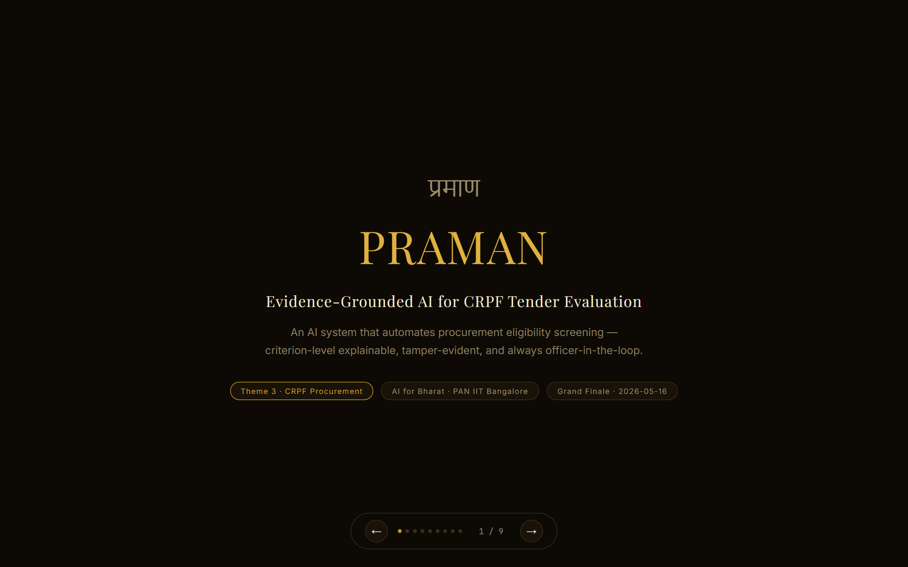
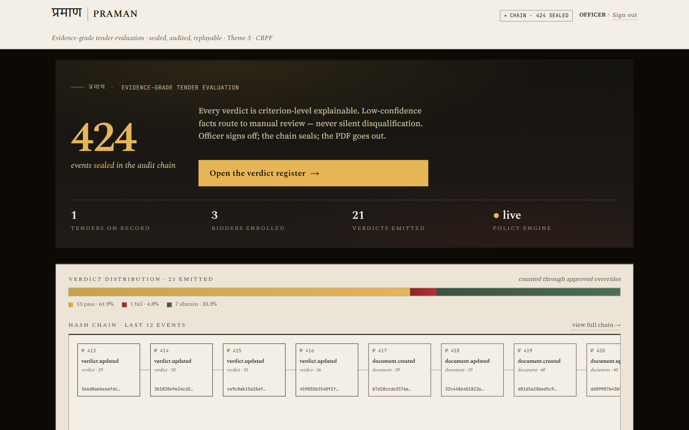
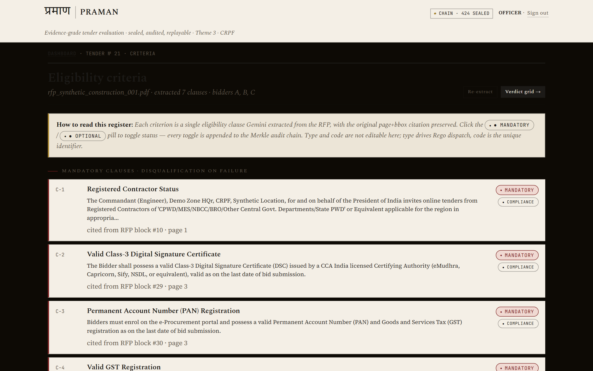
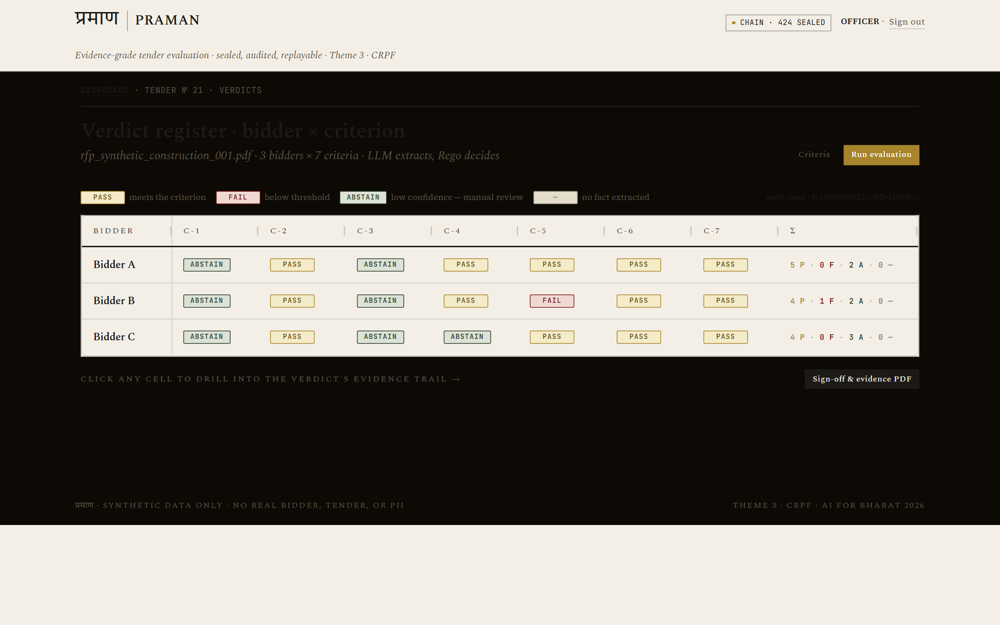
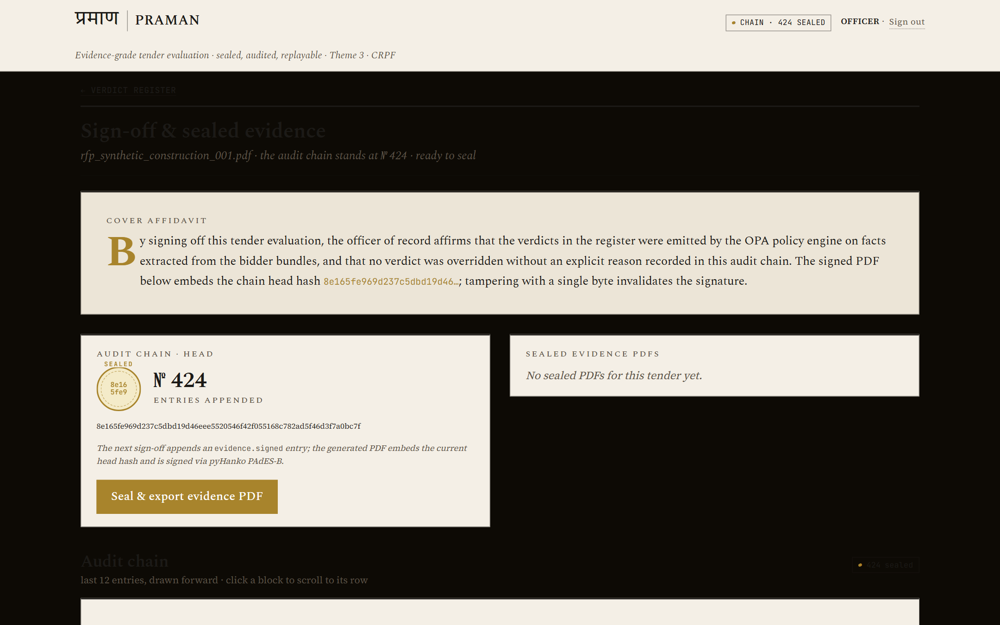

# Praman · प्रमाण

> *LLMs extract. Rego decides.*

**AI-powered tender eligibility evaluation** — Round 2 submission to the **AI for Bharat Hackathon 2026** (PAN IIT Bangalore + Government of Karnataka), Theme 3: AI-Based Tender Evaluation and Eligibility Analysis for Government Procurement by CRPF.

**Grand Finale · 2026-05-16 · Taj Yeshwantpur, Bengaluru**

---

## What it does

Praman parses a government tender (RFP) + bidder document bundles, extracts eligibility criteria and per-bidder facts via Gemini 2.5, then evaluates every fact against a formal Rego policy rule — not an LLM guess. The output is a per-criterion verdict matrix (PASS / FAIL / ABSTAIN) that is criterion-level explainable, Merkle-chained in an audit log, and cryptographically signed.

### Four mechanical commitments

| # | Commitment | Mechanism |
|---|---|---|
| 1 | Every verdict is criterion-level explainable | `rule_id` + `bindings_json` + `reason` + bbox-cited evidence blocks |
| 2 | Never silently disqualify | Low-confidence or missing facts → `ABSTAIN` → human review, never `FAIL` |
| 3 | Scanned + photo document support | Docling (digital PDFs) + Gemini Vision (scanned / distorted, with OCR confidence) |
| 4 | End-to-end auditable + signed evidence PDF | Merkle-chained log (RFC-8785 + SHA-256) + pyHanko PAdES-B signed PDF |

---

## Screenshots

### Title Slide


### Dashboard — 424 verdicts, audit chain sealed


### Criteria Review — 7 extracted eligibility criteria with clause citations


### Verdict Grid — Bidder × Criterion matrix (PASS / FAIL / ABSTAIN)


### Sign-off & Evidence PDF — affidavit, Merkle chain, sealed PDF export


---

## Architecture — 5-lane pipeline

```
  PDF files
      │
      ▼
  ┌──────────┐   Docling (digital)
  │  INGEST  │   Gemini Vision (scanned / distorted)
  └────┬─────┘
       │  Block rows (text + bbox + OCR confidence)
       ▼
  ┌──────────┐   Gemini 2.5 Pro  → Criterion rows
  │ EXTRACT  │   Gemini 2.5 Flash → Fact rows (per bidder)
  └────┬─────┘
       │
       ▼
  ┌──────────┐   parsers.py (rupee / GSTIN / DSC / ISO / works)
  │ EVALUATE │   OPA + Rego rules → Verdict rows (PASS / FAIL / ABSTAIN)
  └────┬─────┘
       │
       ▼
  ┌──────────────┐   Django signals → Merkle-chained AuditEntry
  │ AUDIT & SIGN │   pyHanko PAdES-B → signed evidence PDF
  └────┬─────────┘
       │
       ▼
  ┌────────────┐   5 hero screens:
  │ OFFICER UI │   upload → criteria → grid → drilldown → sign-off
  └────────────┘
```

Full diagram: [`docs/architecture.svg`](docs/architecture.svg)

---

## Tech stack

| Layer | Technology | Purpose |
|---|---|---|
| Web framework | Django 5.0 | Application server |
| Document parsing | Docling 2.0 | Digital PDF text + bounding boxes |
| Vision OCR | Gemini 2.5 Vision | Scanned / distorted documents with confidence scores |
| LLM extraction | Gemini 2.5 Pro / Flash | Criteria + facts extraction from PDFs |
| Policy engine | OPA + Rego | One rule per criterion category; LLM never votes |
| Audit log | SQLite + Python Merkle chain | RFC-8785 canonical JSON + SHA-256 chaining |
| PDF signing | pyHanko (PAdES-B) | Cryptographic evidence export |
| Frontend | HTMX + AG-Grid + Tailwind CSS | Zero CDN dependencies at runtime |

---

## Quick start

**Operator runbook (7 steps, < 1 minute from fresh clone):** [docs/QUICKSTART.md](docs/QUICKSTART.md)

```bash
# One-time setup
git clone https://github.com/amberIS01/ai_bharat.git
cd ai_bharat
python -m venv .venv
source .venv/bin/activate          # Windows: .venv\Scripts\activate
pip install -r requirements.txt
python manage.py migrate

# Terminal 1 — start OPA (keep running)
deploy/bin/opa run --server --addr 127.0.0.1:8181 --log-level error deploy/rules/

# Terminal 2 — restore demo snapshot and run
python manage.py bootstrap_demo --restore-snapshot
python manage.py verify_demo       # must print: "=== verify_demo PASS — system is demo-ready ==="
python manage.py runserver 0.0.0.0:8000
```

Open **http://localhost:8000/** · Login: `officer` / `praman_demo_2026`

---

## Repository layout

| Path | What |
|---|---|
| `praman/` | Django project root (settings, URLs) |
| `core/` | Domain app: models, parsing, extraction, policy, audit (~1 500 LOC) |
| `officer/` | Officer-facing views + templates (5 hero screens, ~800 LOC) |
| `deploy/rules/` | Rego rules — one file per criterion category |
| `deploy/bin/opa` | OPA binary (~73 MB, committed for instant demo setup) |
| `docs/` | Architecture SVG, deck outline, shot list, operator runbooks |
| `db.sqlite3.demo` | Pre-warmed DB snapshot (745 KB) — instant cold-start |
| `screenshort/` | Demo UI screenshots |

---

## Verdict matrix (demo narrative spine)

| Bidder | C-1 Reg. | C-2 DSC | C-3 PAN | C-4 GST | C-5 Turnover | C-6 Experience | C-7 ISO |
|---|---|---|---|---|---|---|---|
| **A** (clean) | ABSTAIN¹ | PASS | ABSTAIN¹ | PASS | PASS | PASS | PASS |
| **B** (low turnover) | ABSTAIN¹ | PASS | ABSTAIN¹ | PASS | **FAIL** ² | PASS | PASS |
| **C** (distorted GST cert) | ABSTAIN¹ | PASS | ABSTAIN¹ | **ABSTAIN** ³ | PASS | PASS | PASS |

¹ No Rego rule mapped → system routes to manual review  
² Turnover Rs. 4.2 Cr below Rs. 5 Cr threshold (genuine FAIL)  
³ Bidder C's GST cert is intentionally distorted → Gemini Vision OCR confidence 0.80 < 0.85 threshold → `ABSTAIN low_confidence` (marquee demo moment)

---

## Tests

```bash
pytest                                           # 228 passed, 2 skipped
python manage.py verify_day11 --skip-bootstrap  # load-bearing acceptance gate
python manage.py verify_demo                    # 8-point pre-flight check
```

---

## Core principles

- **The LLM decides nothing.** Verdicts come from OPA + Rego rules.
- **Every verdict is criterion-level explainable** — `rule_id` + variable bindings + cited evidence spans.
- **Never silently disqualify** — low-confidence or missing data → `ABSTAIN`, never `FAIL`.
- **Audit log is append-only and Merkle-hash-chained.** Signed evidence PDF required at sign-off.
- **No real tender / bidder data.** Synthetic RFPs and bidder bundles only.
- **Air-gapped story holds.** Demo uses hosted Gemini; production swap is local Qwen2.5-VL via vLLM.

---

## Project state

- **Days 1–15 shipped.** Full pipeline: ingest → extract → evaluate → audit → sign.
- **Tests:** 228 passed, 2 skipped. Zero failures.
- **Frozen:** 2026-05-03. See [FREEZE.md](FREEZE.md) for freeze state + demo-morning ritual.
- **Demo:** 2026-05-16, Taj Yeshwantpur, Bengaluru.

---

## Hackathon meta

Solo build by **Sahil** — code, architecture, and stage defence. Team contributes pitch deck design + 5-min demo video.

- **Repo:** https://github.com/amberIS01/ai_bharat
- **Contact:** sahilsingh8300@gmail.com
- **Team handover doc:** [HANDOVER.md](HANDOVER.md)
- **Juror / reviewer:** start with [docs/architecture.svg](docs/architecture.svg) then [docs/deck_outline.md](docs/deck_outline.md)
